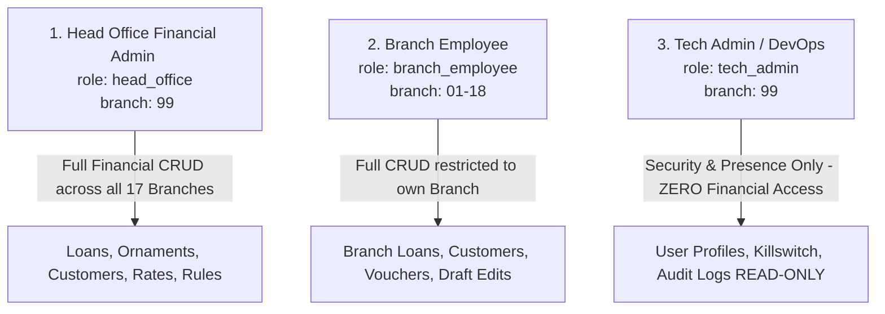

# The Junagadh Commercial Co-operative Bank Ltd. (JCCB)
## Role-Based Access Control (RBAC) & Privileges Matrix
**Document ID:** `JCCB-SEC-RBAC-20260902-FINAL`  
**Classification:** Confidential — Internal Banking Standard  
**Target Architecture:** Supabase (PostgreSQL with Instant-Revocation RLS & Server-Side Trigger Audit Logging)  
**Date:** September 02, 2026  

---

## 1. Finalized 3-Role Architecture

The bank system enforces a **3-Role Standard** designed around strict separation of duties, zero client trust, and multi-branch tenancy:

### Role Definitions & Responsibilities:

| Role Identifier (`role`) | Primary Operator | Scope | Financial Data Access | Security & User Management Access |
| :--- | :--- | :--- | :---: | :---: |
| **`head_office`** | Head Office Management / Loan Committee | All 17 Branches (`99`) | **Full CRUD** | View Only |
| **`branch_employee`** | Branch Managers & Loan Operators | Assigned Branch (`01`–`18`) | **Full CRUD (Own Branch Only)** | None |
| **`tech_admin`** | IT & System Administrators | Bank Infrastructure | **ZERO (Blocked by RLS)** | **Full Control** |

---

## 2. Answers to Core Architecture Questions

### Question 1: JWT Claims vs. Instant Revocation Lookup Table
> **Q:** *If we deactivate a `branch_employee` mid-shift, how long would an existing JWT grant access?*

* **Answer:** With standard JWT custom claims (`auth.jwt() ->> 'role'`), the access token remains cryptographically valid for **1 hour (3600 seconds)** until the token expires and attempts a refresh. This is an unacceptable security window for a bank.
* **Solution Implemented:** All RLS policies query the `public.user_profiles` table on **every single SQL query** via the `SECURITY DEFINER` function `get_auth_profile()`.
* **Zero-Millisecond Revocation:** The instant an admin sets `is_active = FALSE` in `user_profiles`, `get_auth_profile()` returns 0 rows, and the employee's very next HTTP/SQL request is **immediately rejected (0 ms delay)** with a SQL `403 Forbidden`.

---

### Question 2: Draft Loan Editing Permissions
> **Q:** *Can a `branch_employee` edit/correct a loan they just created before it is sanctioned/finalized?*

* **Codebase Finding:** In [`app_gold.js:L4340-L4400`](file:///d:/JCCBGold-main%2021082026-20260829T025201Z-1-001/JCCBGold-main%2021082026/app_gold.js#L4340-L4400), branch employees can edit application details, customer info, and ornament items while the record is in draft status.
* **RLS Policy Implementation:**
  * `branch_employee` can `UPDATE` and `DELETE` loans belonging to their `branch_id` **ONLY IF** `loan_status IN ('New', 'Draft')`.
  * Once the loan status is updated to `'Sanctioned'`, `'Disbursed'`, `'Active'`, or `'Closed'`, RLS blocks `branch_employee` from updating or deleting the record.
  * `head_office` retains the ability to modify or override loans at any stage.

---

### Question 3: 100% Server-Side Immutable Audit Logging
> **Policy:** *NO client role gets direct INSERT, UPDATE, or DELETE access to `audit_logs`. All logs are written exclusively via PostgreSQL triggers.*

* **Implementation:**
  1. `public.audit_logs` has **ZERO client INSERT/UPDATE/DELETE policies**.
  2. A central PostgreSQL `SECURITY DEFINER` trigger function (`process_audit_log_trigger()`) is attached to `loans`, `rates`, `rules_master`, `valuers`, `active_sessions`, and `user_profiles`.
  3. Every mutation captures the actor's `user_id`, `full_name`, `branch_id`, timestamp, old/new diffs, and IP metadata automatically inside the database engine.
  4. Logging cannot be skipped, forged, or bypassed by client-side JavaScript.

---

## 3. Comprehensive Master Privileges Matrix (CRUD)

| System Capability | Head Office (`head_office`) | Branch Employee (`branch_employee`) | Tech Admin (`tech_admin`) |
| :--- | :---: | :---: | :---: |
| **View Loans & Customer KYC** | ✅ All 17 Branches | ✅ Own Branch Only | ❌ **FORBIDDEN (0 Rows Returned)** |
| **Create New Loan Application** | ✅ All Branches | ✅ Own Branch Only | ❌ Forbidden |
| **Edit Draft Loan (`New`/`Draft`)**| ✅ All Branches | ✅ Own Branch Only | ❌ Forbidden |
| **Edit Sanctioned / Active Loan**| ✅ All Branches | ❌ **FORBIDDEN (RLS Blocked)** | ❌ Forbidden |
| **Delete Loan Record** | ✅ All Branches | ✅ Own Branch (`Draft` only) | ❌ Forbidden |
| **Daily Gold Rate (22K/24K)** | **Create / Edit / Lock** | View Only | View Only |
| **Rules Master & Schemes** | **Full Control** | View Only | View Only |
| **Valuers Master** | **Full Control** | View Only | View Only |
| **Branch Master Directory** | **Full Control** | View Only | View Only |
| **User Profiles & Role Provisioning**| View Only | View Own Profile | **Full Control (Activate/Deactivate)** |
| **Active Sessions Monitor** | View All | View Own Session | View All |
| **Remote Session Killswitch** | ✅ Force Disconnect | ❌ Forbidden | ✅ Force Disconnect |
| **Audit Logs Inspection** | ✅ Full Read-Only | ❌ **FORBIDDEN** | ✅ Full Read-Only |
| **Direct Audit Log Modification** | ❌ **NEVER (No Client Writes)** | ❌ **NEVER (No Client Writes)** | ❌ **NEVER (No Client Writes)** |

---

## 4. Production SQL Reference

The complete production PostgreSQL DDL, helper functions, RLS policies, and triggers are defined in:
👉 **[`schema_and_rls_policies.sql`](file:///d:/JCCBGold-main%2021082026-20260829T025201Z-1-001/JCCBGold-main%2021082026/schema_and_rls_policies.sql)**
